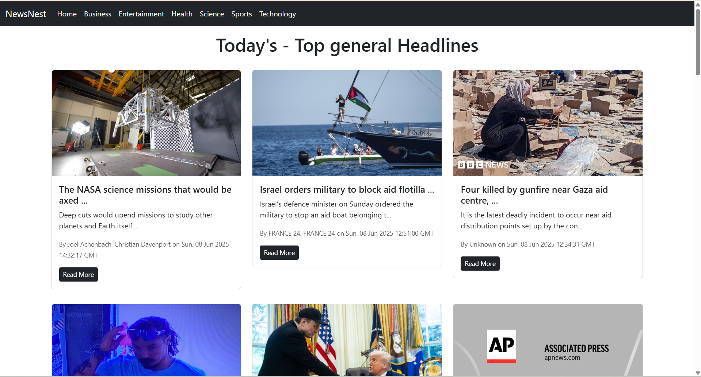
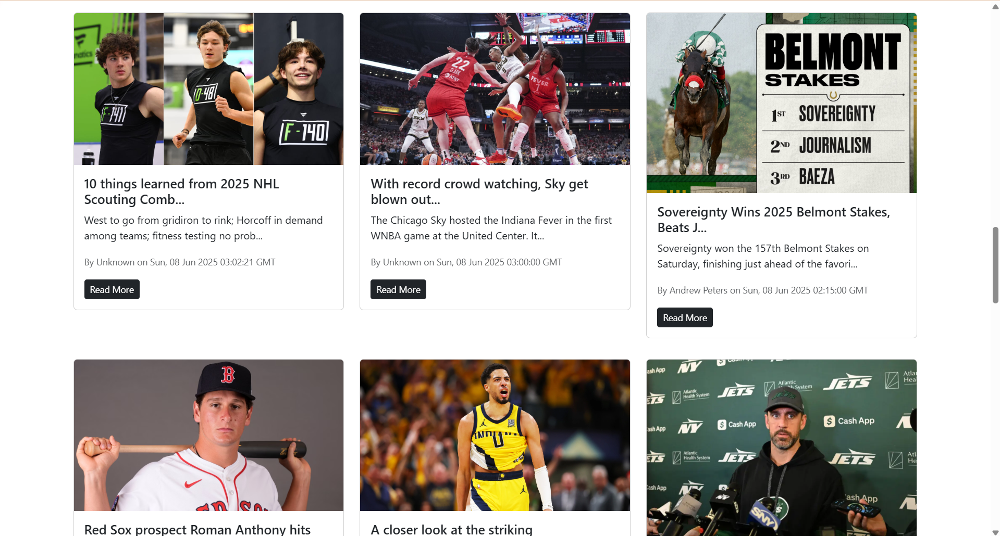

# 📰 NewsNest - A React-Based News App

NewsNest is a modern and responsive single-page React application that fetches and displays the latest news articles using the [NewsAPI](https://newsapi.org/). It features infinite scrolling, category-based filtering, and a clean UI built with Bootstrap.

---

## 📸 Screenshots

<!-- Replace the image paths with your actual screenshot file paths or hosted URLs -->

---

## 🚀 Features

- 🔍 Real-time news powered by NewsAPI
- 🗂️ Category selection (Business, Entertainment, Health, Science, Sports, Technology)
- 🔄 Infinite scroll to load more articles dynamically
- 🔼 Loading bar indicator for a better UX
- 📱 Fully responsive design using Bootstrap
- 🔒 API key stored using environment variables

---

## 🛠️ Tech Stack

- React.js
- React Router
- Bootstrap 5
- NewsAPI
- Vercel (Deployment)

---
